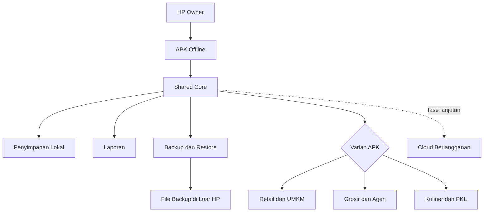
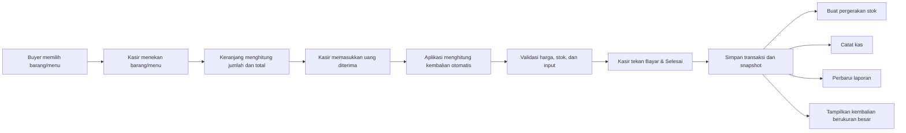
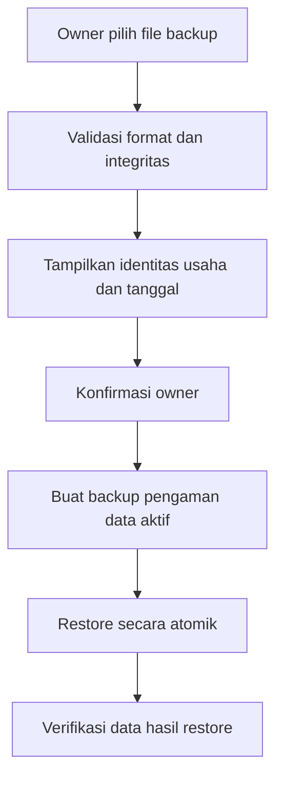

# Arsitektur Usaha Kecil Suite

## Status dokumen

Dokumen ini mencatat arsitektur produk dan implementasi aktif per 31 Juli 2026.

Status saat ini:

- framework aktif: Kotlin 2.3.0 dan Jetpack Compose;
- database lokal aktif: Room 2.8.4;
- satu module aplikasi menghasilkan tiga product flavor;
- database memakai skema versi 4 dengan migrasi eksplisit dari versi 1, 2, dan 3;
- katalog, kategori, varian, keranjang persisten, pembayaran, transaksi atomik, stok, pembelian, kas, utang-piutang, tenaga kerja, laporan terlindungi, backup/restore, export `.xlsx`, struk PNG, dan kalkulator sudah diimplementasikan;
- panduan wajib first-run menjelaskan Mode Kasir/Pekerja dan Mode Owner sebelum aplikasi dapat dipakai;
- kemampuan khusus Grosir dan Kuliner dikendalikan oleh `BusinessCapabilities`;
- APK debug Retail, Wholesale, dan Culinary dibangun dari shared source;
- GitHub Actions memverifikasi unit test, kompilasi test instrumentasi, build debug/release, dan lint seluruh flavor;
- forecasting penjualan offline sudah dihitung dari histori transaksi pada layar Laporan Owner;
- shift kasir menyimpan `shiftId` pada transaksi dan jurnal kas, membatasi satu shift aktif, serta menyimpan snapshot saat ditutup;
- forecasting restock, retur/refund, cloud, pajak otomatis, HPP/laba, payroll formal, printer, marketplace, payment gateway, serta multi-device belum diimplementasikan.

## Tujuan sistem

Usaha Kecil Suite adalah source bersama untuk keluarga APK Android operasional usaha mikro dan bisnis kecil.

Target varian yang sudah disetujui:

1. Retail dan UMKM;
2. Grosir dan Agen;
3. Kuliner dan Pedagang Kaki Lima.

Setiap varian boleh mempunyai nama, ikon, navigasi, dan modul khusus. Domain inti, penyimpanan, validasi, laporan, serta backup harus tetap dibangun dari source bersama.

## Bentuk sistem



MVP berjalan pada satu HP owner dan tidak membutuhkan akun, internet, atau server untuk operasional dasar.

## Batas source

Struktur source bersama:

```text
shared core
├─ domain bisnis
├─ penyimpanan lokal
├─ validasi
├─ laporan
├─ backup dan restore
└─ komponen UI bersama

varian aplikasi
├─ Retail dan UMKM
├─ Grosir dan Agen
└─ Kuliner dan PKL
```

Tiga varian tidak boleh menjadi tiga codebase yang disalin. Bug pada domain inti harus dapat diperbaiki sekali dan diverifikasi pada seluruh varian terdampak.

Struktur teknis aktif:

```text
app/src/main
├─ domain
├─ data (Room, repository, dan seed catalog)
├─ ui (Compose adaptif HP/tablet)
├─ share (struk PNG dan FileProvider)
└─ shared resources

app/src/retail
app/src/wholesale
app/src/culinary
```

| Flavor | Application ID | Tema |
|---|---|---|
| `retail` | `com.bimacore.usahakecil.retail` | Jade hijau `#0B6B5E` |
| `wholesale` | `com.bimacore.usahakecil.wholesale` | Cobalt biru `#2457C5` |
| `culinary` | `com.bimacore.usahakecil.culinary` | Terracotta `#A44322` |

## Source of truth

Pada MVP offline:

- penyimpanan lokal di HP owner adalah source of truth operasional;
- owner adalah pengguna utama;
- transaksi disimpan langsung ke penyimpanan lokal;
- laporan dihitung dari data lokal;
- backup adalah salinan pemulihan, bukan database aktif kedua;
- file backup yang dibagikan keluar HP menjadi perlindungan ketika HP hilang atau rusak.

Cloud belum menjadi source of truth karena belum termasuk MVP.

## Akses pengguna dan laporan

Aplikasi selalu mulai dalam Mode Kasir/Pekerja. Pada first-run, `FirstRunGuide` menahan akses sampai pengguna menekan `Saya Mengerti, Mulai`; dialog tidak dapat dilewati dengan back atau klik di luar. Pekerja dapat membuka shift dari layar kasir agar operasional offline tidak bergantung pada Owner yang sedang memegang HP. Operasional, keuangan, laporan, profil, backup, dan restore tetap menjadi area Owner yang baru muncul setelah PIN Owner terverifikasi.

Aturan yang sudah dikunci:

- pekerja dapat menjalankan flow penjualan serta melihat total transaksi aktif dan stok produk pada layar kasir;
- pekerja dapat membuka shift dengan nama kasir, modal awal, dan catatan pembuka dari layar kasir;
- Owner tidak perlu membuka shift untuk masuk ke Operasional, Keuangan, Laporan, profil, backup, restore, atau Export Excel;
- shift hanya wajib saat kasir menyelesaikan transaksi penjualan; pembukaan dan penutupan shift tetap dicatat terpisah dari akses Mode Owner;
- pekerja tidak dapat melihat omzet harian, riwayat penjualan, operasional, keuangan, laporan, profil, backup, atau restore;
- pekerja tidak dapat melihat ringkasan kas, menutup shift, atau membaca riwayat shift;
- tombol area Owner disembunyikan saat sesi terkunci dan tidak ada tujuan navigasi langsung menuju layar pengelolaan;
- verifikasi harus bekerja sepenuhnya secara offline;
- satu PIN Owner membuka seluruh area pengelolaan pada MVP;
- PIN tidak boleh disimpan dalam bentuk plaintext;
- sesi Owner tetap terbuka selama proses aplikasi berjalan dan hanya dikunci saat Owner menekan `Keluar Mode Owner` atau `Kunci Mode Owner`;
- repository laporan tetap menolak pembacaan saat sesi Owner terkunci.

PIN digunakan sebagai mekanisme utama MVP karena sederhana dan tidak bergantung pada sensor HP. Biometrik dapat menjadi jalan pintas tambahan nanti, tetapi tidak menggantikan PIN.

Satu PIN Owner hanya membuktikan bahwa pengguna mengetahui PIN. MVP belum memakai akun pekerja individual.

## Modul domain bersama

### Penjualan

Mencatat transaksi, item, kuantitas, metode pembayaran, total, status, dan waktu transaksi.

Transaksi harus menyimpan snapshot minimal:

- identitas produk;
- nama produk ketika dijual;
- kategori ketika dijual;
- satuan ketika dijual;
- harga jual per satuan;
- kuantitas;
- subtotal;

Snapshot HPP atau pajak baru boleh ditambahkan setelah metode terkait disetujui. Rilis aktif tidak menghitung laba karena metode HPP belum dipilih.

Perubahan produk setelah transaksi tidak boleh mengubah histori.

### Kalkulator kasir

Setiap varian yang mempunyai layar kasir wajib menyediakan kalkulator bawaan dan dapat digunakan sepenuhnya secara offline.

Batas behavior yang sudah dikunci:

- kalkulator mudah dibuka dari layar kasir;
- fungsi minimal mendukung penjumlahan, pengurangan, perkalian, pembagian, persen, hapus satu angka, dan bersihkan;
- perhitungan kalkulator tidak langsung mengubah keranjang, nilai pembayaran, kas, stok, atau laporan;
- kalkulator umum berdiri sebagai alat bantu dan terpisah dari perhitungan pembayaran.

Perhitungan kembalian tidak memakai tombol `Gunakan hasil`. Kasir memasukkan uang yang diberikan buyer pada kolom `Uang Diterima`, lalu aplikasi langsung menghitung:

`Kembalian = Uang Diterima - Total Belanja`

### Produk atau menu

Menyimpan barang atau menu yang dapat dijual. Field khusus varian tidak boleh dipaksa masuk ke varian lain jika tidak relevan.

Contoh perbedaan:

- Retail: barang eceran, pakaian, dan barcode opsional;
- Grosir: konversi pcs, pak, dan dus;
- Kuliner: menu serta bahan baku opsional.

### Stok

Stok berasal dari pergerakan:

- pembelian;
- penjualan;
- retur masuk;
- retur keluar;
- rusak;
- hilang;
- penyesuaian manual.

Setiap penyesuaian manual wajib menyimpan alasan. Sistem tidak boleh membuat stok negatif secara diam-diam.

Metode penilaian HPP belum diputuskan dan tidak boleh diimplementasikan sebelum ada spesifikasi tersendiri.

### Pembelian dan supplier

Pembelian mencatat supplier, item, jumlah, satuan, harga beli, waktu, serta status pembayaran jika diperlukan.

Harga beli baru tidak otomatis mengganti harga jual. Shared core boleh menghitung dampak margin dan memberi peringatan kepada owner.

### Pengeluaran dan kas

Pengeluaran operasional, kas masuk, dan kas keluar harus mempunyai kategori, nominal, waktu, serta catatan.

Istilah finansial harus dibedakan:

- omzet;
- uang diterima;
- HPP;
- laba kotor;
- pengeluaran;
- laba bersih;
- utang;
- piutang.

### Utang dan piutang

Utang supplier dan piutang pelanggan harus mempunyai:

- pihak terkait;
- nilai awal;
- pembayaran yang sudah diterima atau dibayar;
- sisa;
- tanggal;
- status;
- histori perubahan.

Pelunasan tidak boleh menghapus histori.

### Tenaga kerja

Satu modul mendukung:

#### Pekerja harian

- owner mencatat hadir, setengah hari, izin, atau tidak hadir;
- tarif mempunyai tanggal berlaku;
- lembur, bonus, kasbon, dan potongan dicatat terpisah;
- pembayaran periode lama tidak berubah ketika tarif diperbarui.

#### Freelancer atau pekerja panggilan

- owner mencatat pekerjaan atau tugas;
- bayaran berdasarkan pekerjaan atau kesepakatan;
- absensi tidak wajib;
- pembayaran menyimpan tanggal dan status.

MVP tidak memakai login, PIN, GPS, selfie, atau absensi mandiri pekerja.

BPJS, PPh 21, dan payroll formal belum termasuk MVP.

### Pajak

Pajak adalah modul opsional.

Aturan desain:

- jangan hardcode tarif permanen;
- simpan tanggal berlaku;
- simpan snapshot pajak pada transaksi;
- bedakan status usaha dan jenis transaksi jika nanti diperlukan;
- verifikasi aturan terbaru dari sumber resmi sebelum implementasi.

## Varian aplikasi

| Kemampuan | Retail dan UMKM | Grosir dan Agen | Kuliner dan PKL |
|---|---|---|---|
| Penjualan | Aktif | Aktif | Aktif |
| Kalkulator kasir offline | Wajib | Wajib | Wajib |
| Produk/menu | Produk retail | Barang grosir | Menu |
| Stok | Aktif | Aktif | Aktif atau sederhana |
| Multi-satuan | Tidak ditampilkan | Aktif | Tidak ditampilkan |
| Harga bertingkat | Tidak ditampilkan | Aktif | Tidak ditampilkan |
| Piutang pelanggan | Aktif | Aktif | Tidak ditampilkan |
| Bahan baku/resep | Tidak ditampilkan | Tidak ditampilkan | Aktif |
| Pegawai harian/freelance | Aktif | Aktif | Aktif |
| Backup/restore | Aktif | Aktif | Aktif |

Matriks ini adalah konfigurasi aktif rilis `0.2.1`.

## Alur transaksi



Penyimpanan transaksi, pergerakan stok, dan kas harus konsisten. Jika salah satu bagian gagal, transaksi tidak boleh terlihat setengah berhasil.

Aturan flow tunai:

- menekan barang/menu menambah item ke keranjang;
- perubahan jumlah langsung memperbarui total belanja;
- nilai uang diterima dimasukkan oleh kasir;
- kembalian diperbarui otomatis setiap kali nilai uang diterima berubah;
- jika uang diterima lebih kecil daripada total, tampilkan `Uang Kurang` sebesar selisihnya dan jangan tampilkan kembalian negatif;
- tombol penyelesaian transaksi tetap nonaktif selama uang diterima kurang;
- tombol penyelesaian dapat aktif ketika uang diterima sama dengan atau lebih besar daripada total;
- tombol konfirmasi akhir memakai label `Bayar & Selesai`;
- transaksi baru dianggap berhasil setelah tombol tersebut ditekan dan seluruh penyimpanan berhasil;
- uang diterima dan kembalian disimpan pada snapshot pembayaran transaksi;
- transaksi, pergerakan stok, catatan kas, dan data laporan harus diperbarui sebagai satu operasi konsisten;
- jika salah satu penyimpanan gagal, jangan kurangi stok atau membuat catatan keuangan setengah jadi;
- setelah berhasil, tampilkan nominal kembalian dengan ukuran besar.

## Backup dan restore

### Backup

Backup harus memuat:

- versi format;
- identitas usaha;
- waktu pembuatan;
- data yang diperlukan untuk pemulihan;
- pemeriksaan integritas.

Backup otomatis di HP tidak cukup. Owner harus diingatkan untuk membagikan file backup ke lokasi di luar HP.

### Restore



Restore gagal tidak boleh meninggalkan data setengah terpasang.

Backup dianggap selesai hanya setelah proses restore diuji pada data nyata pengujian.

## Export Excel

Owner dapat membuat file `.xlsx` langsung dari database lokal tanpa internet. Workbook memakai format OpenXML dan berisi `Info Export`, `Ringkasan`, serta tabel operasional seperti produk, transaksi, pembelian, kas, shift, utang-piutang, stok, dan tenaga kerja. Lebar tiap kolom dihitung dari teks terpanjang dengan batas wajar 10–72 karakter. Draft keranjang serta hash PIN Owner tidak ikut diekspor.

Export hanya tersedia pada area Owner dan file dibagikan melalui mekanisme share Android. Data diekspor sebagai snapshot saat tombol export ditekan; export tidak mengubah transaksi, stok, atau histori finansial. Periode saat ini masih seluruh data offline; filter harian/mingguan/bulanan/tahunan, chart Excel, forecasting Excel, dan analisis laba belum termasuk karena HPP belum dikunci.

## Cloud fase lanjutan

Cloud baru dipertimbangkan setelah APK offline stabil dan digunakan nyata.

Kemampuan yang mungkin ditambahkan:

- backup otomatis di luar perangkat;
- pemulihan ketika ganti atau kehilangan HP;
- sinkronisasi multi-device;
- multi-outlet;
- pemantauan owner dari jarak jauh.

MVP tidak boleh bergantung pada API cloud.

Shared core cukup mempersiapkan:

- identitas record yang stabil;
- waktu pembuatan dan perubahan;
- versi skema;
- format backup berversi.

Algoritma sinkronisasi, resolusi konflik, provider, harga langganan, dan masa simpan data cloud belum diputuskan.

Berhentinya layanan atau langganan cloud tidak boleh merusak data lokal owner.

## Keamanan dan privasi

- Validasi input dilakukan pada batas domain, bukan hanya pada tampilan.
- Nilai uang dan kuantitas memakai safe integer serta batas yang masuk akal.
- Laporan penjualan wajib memeriksa sesi Owner sebelum data dibaca.
- PIN atau credential yang nanti ditambahkan tidak boleh disimpan plaintext.
- Jangan log credential, isi backup sensitif, atau data pribadi lengkap.
- Data pelanggan dan pekerja dikumpulkan hanya jika dibutuhkan.
- Export dan restore hanya dilakukan oleh owner.
- Aksi hapus, reset, restore, dan koreksi finansial membutuhkan konfirmasi yang jelas.

Teknologi enkripsi dan secure storage ditentukan setelah stack aplikasi dipilih.

## Hubungan dengan MAUCAFE

Usaha Kecil Suite dan MAUCAFE adalah project berbeda.

- Data tidak dibagi otomatis.
- Siklus rilis tidak digabung otomatis.
- Requirement antrean, display TV, franchise, dan role MAUCAFE tidak masuk ke shared core tanpa keputusan baru.
- Source MAUCAFE boleh dijadikan referensi, bukan disalin massal.
- Integrasi kedua project membutuhkan spesifikasi dan persetujuan tersendiri.

## Implementasi aktif

- Room adalah source of truth lokal.
- Draft cart disimpan di database dan bertahan setelah process restart.
- Harga memakai integer Rupiah `Long`; quantity mempunyai batas aman.
- Transaksi, item snapshot, pengurangan stok, dan penguncian draft dilakukan dalam satu transaksi Room.
- `completedSaleId` membuat double submit mengembalikan struk yang sama.
- Cart baru dikosongkan ketika user menekan `Transaksi Baru`.
- QRIS dan Transfer hanya dicatat setelah konfirmasi manual.
- Struk dibagikan sebagai PNG lewat cache dan `FileProvider`; aplikasi tidak meminta akses seluruh penyimpanan.
- Manifest tidak meminta permission internet.
- Layar di bawah 840 dp memakai flow bertahap. Layar 840 dp atau lebih menampilkan katalog dan cart/pembayaran berdampingan.
- `BusinessCapabilities` menentukan modul yang tampil dan aturan yang berlaku per flavor.
- Pembelian memperbarui stok, kas, dan utang dalam satu transaksi database.
- Penjualan memperbarui snapshot transaksi, stok atau bahan, kas, dan piutang secara atomik.
- Laporan memeriksa sesi PIN pada repository, bukan hanya pada tampilan.
- PIN memakai PBKDF2 dengan salt dan tidak disimpan sebagai teks asli.
- Sesi laporan tidak memakai timeout atau auto-lock saat aplikasi kehilangan fokus; Owner menguncinya secara manual.
- Setelah proses aplikasi dihentikan dan dibuat ulang, aplikasi tetap mulai dalam Mode Kasir/Pekerja dan PIN Owner perlu diverifikasi lagi.
- Backup melakukan WAL checkpoint, menyimpan manifest dan hash SHA-256, lalu restore membuat backup pengaman sebelum mengganti database.
- Grosir mengubah satuan jual ke satuan dasar sebelum mengurangi stok.
- Kuliner menyimpan topping/catatan sebagai snapshot dan mengurangi bahan resep ketika checkout.

## Perintah build dan test

```powershell
.\gradlew.bat testRetailDebugUnitTest testWholesaleDebugUnitTest testCulinaryDebugUnitTest
.\gradlew.bat assembleDebug
.\gradlew.bat assembleRetailDebugAndroidTest assembleWholesaleDebugAndroidTest assembleCulinaryDebugAndroidTest
```

Connected test hanya dijalankan setelah target device atau emulator dikonfirmasi user.

## Keputusan arsitektur yang masih terbuka

Keputusan berikut belum final:

- metode penilaian HPP;
- urutan rilis varian;
- dukungan usaha jasa;
- integrasi printer dan barcode;
- durasi akses laporan sebelum terkunci kembali;
- model cloud dan sinkronisasi.

Keputusan terbuka tidak boleh diisi berdasarkan tebakan.

## Aturan pembaruan dokumen

Dokumen ini harus diperbarui ketika:

- batas modul berubah;
- teknologi utama dipilih;
- format data berubah;
- varian baru ditambah;
- cloud mulai dirancang;
- keputusan keamanan atau backup berubah.

Perubahan kode yang mengubah arsitektur tanpa memperbarui dokumen ini belum selesai.
